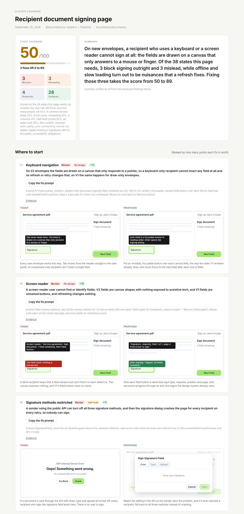

# DS State Gen

A multi-agent Claude Code tool that generates complete UI state coverage for any feature. You design the happy path. It generates everything else.



**[Example: Documenso's signing page, 50/100](examples/documenso-signing/report.html)** · **[Supabase SQL editor](examples/supabase-sql-editor/report.html)** · [FlyTabs editor](examples/flytabs-editor.html) · [FlyTabs landing page](examples/flytabs-landing.html)

## The Problem

Designers create the happy path, ship it to developers, and then spend weeks handling "what about the loading state?" and "what happens when there's no data?" in follow-up tickets.

Existing tools (StateBuilder, Figma plugins) only handle component-level states (hover, focus, disabled). Nobody generates screen-level states: what happens when the network drops, the session expires, the user has no data, or they're on mobile.

## What This Does

1. Point it at your project (or just describe what you're building)
2. A multi-agent pipeline reads your codebase, enumerates states, audits coverage, and builds a report
3. You get a self-contained HTML report: coverage matrix, gap analysis, and visual mockups using your actual DS tokens

The output is actionable: every gap cites what DS components to reuse, what tokens to extend, and what's genuinely new.

## `/states` — the Claude Code skill

The pipeline below, refined into a skill you run while building. AI builds the happy path; `/states` finds what happens when things go wrong, ranks it by harm to the user, and fixes it with the project's own components.

- **Plan** — `/states "invoice table with filters and bulk delete"`: no code yet, lists the states to build and a prompt to paste into your build.
- **Check** — `/states` (changed files on the branch) or `/states src/app/invoices`: a script scopes the files in about a second, then three reviewers run in parallel through different lenses (actions and guards, screens and copy, accessibility). Findings are merged, a sceptical verifier agent reopens every cited line and drops what the code already handles, and the rest are ranked blocker / misleading / nuisance. The result is an HTML report with browser screenshots of each problem as it is today, the proposed fix, and a score.
- **Fix** — opt-in (`fix` or `fix 1, 3`): fixes the chosen findings with the project's own components, reruns the screenshots, and marks a fix "verified" only when the after-shot shows it.

Install by linking the `skill/` folder into your project's or user's Claude Code skills:

```
ln -s /path/to/ds-state-gen/skill ~/.claude/skills/states
```

Evals (fixture app with known answers, real-repo cases) live in [`evals/`](evals/).

## Quick Scan (seconds, no AI)

```
node quick-scan.mjs ~/myapp
node quick-scan.mjs ~/myapp --scope src/checkout --scope packages/ui   # one feature
```

Searches the code for signs that 25 unhappy-path states are handled at all: loading, empty, crash screen, retry, offline, session expired, unsaved work, keyboard, screen reader, reduced motion and more. It also flags concrete problems: canvases that only work with a mouse, clickable `div`s a keyboard can't reach, images without alt text. It writes `reports/<name>-quick.html` and a share card, and takes under a second on a 2,000-file repo.

It finds patterns, so it can say "no offline handling anywhere" but not "this error message is misleading". Use it for the first picture, then run the deep audit (below) on the feature that matters. It reads web code only (JS/TS, Vue, Svelte, CSS) and refuses native apps rather than print a wrong score.

## Architecture

This is a multi-agent pipeline, not a single prompt. Each agent has specialized expertise and a narrow task. The orchestrator chains them, reviews outputs between stages, and makes routing decisions.

```
User: "Generate states for the editor"
         |
         v
  ┌─────────────────┐
  │   Orchestrator   │  ← You talk to this. It coordinates everything.
  └────────┬────────┘
           |
     ┌─────┴─────┐        Phase 1: parallel
     v           v
┌─────────┐ ┌───────────┐
│ Scanner │ │Enumerator │
│         │ │           │
│ Reads   │ │ Reasons   │
│ your DS │ │ about     │
│ tokens, │ │ states    │
│ classes,│ │ from      │
│ patterns│ │ taxonomy  │
│         │ │ + code    │
└────┬────┘ └─────┬─────┘
     |            |
     └──────┬─────┘        Phase 2: sequential
            v
     ┌──────────┐
     │ Auditor  │
     │          │
     │ Searches │
     │ codebase │
     │ for each │
     │ state.   │
     │ Covered? │
     │ Partial? │
     │ Gap?     │
     └────┬─────┘
          |                Phase 3: sequential
          v
     ┌──────────┐
     │ Reporter │
     │          │
     │ Builds   │
     │ HTML     │
     │ report   │
     │ with     │
     │ mockups  │
     └────┬─────┘
          |
          v
   reports/feature.html
```

### Why Multi-Agent?

Each agent has a different job that requires different expertise:

| Agent | Expertise | Tools | Output |
|-------|-----------|-------|--------|
| **DS Scanner** | Forensic code reading. Catalogs every token, component, and pattern. | File reading, grep, find | Structured inventory (JSON) |
| **State Enumerator** | UX reasoning. Thinks about what can go wrong, edge cases, interaction clusters. | Taxonomy lookup, code reading | Complete state list (JSON) |
| **Coverage Auditor** | Evidence-based judgment. For each state, searches the codebase for proof it's handled. | Grep, file reading | Coverage matrix with evidence (JSON) |
| **Report Builder** | Visual rendering. Takes the matrix and builds an HTML report with real DS components. | File writing | Self-contained HTML file |

Scanner and Enumerator run **in parallel** (independent inputs). Auditor needs both their outputs. Reporter needs the Auditor's output plus orchestrator decisions about which findings get visual mockups.

The orchestrator (CLAUDE.md) reviews each agent's output before passing it to the next, catches errors, and makes tier decisions that no single agent has the context to make.

## Getting Started

Clone this repo and open it in Claude Code:

```bash
git clone https://github.com/user/ds-state-gen.git
cd ds-state-gen
```

Then tell it about your project:

> "My project is at ~/myapp"

It creates a config, then on your next request runs the full pipeline:

> "Generate states for the checkout form"

### No Project Yet?

Works without a codebase too. Just describe what you're building:

> "I'm building an invoice dashboard with Shadcn. Data table with filters, search, pagination, and bulk delete."

Only the Enumerator runs. You get a state checklist and behavioral spec, no coverage analysis.

## Three Scenarios

| Scenario | Agents Used | Output |
|----------|------------|--------|
| **Existing project with DS** | All 4 (Scanner + Enumerator in parallel, then Auditor, then Reporter) | Full report: matrix, coverage evidence, actionable next steps, mockups |
| **Early project, DS picked** | All 4 (Scanner reads framework patterns) | Full report with framework-aware coverage |
| **Day zero, no code** | Enumerator only | State checklist + behavioral spec, no coverage or mockups |

## Two-Tier Reports

Not every finding needs a visual mockup. The pipeline uses a tiered approach:

**Tier 1 (text-only, default):** Every gap/partial state gets a description, what to reuse/extend/build, implementation notes, and accessibility requirements. This is enough for loading skeletons, error toasts, disabled buttons, and any state where the pattern is obvious from the DS references.

**Tier 2 (visual mockup):** The orchestrator promotes 3-5 findings that are genuinely novel, involve complex layout changes, or would be ambiguous without a visual. These get HTML/CSS mockups built from real DS components.

The first real run (Documenso's signing page) still took about 15 minutes and 525K tokens end to end. That is why the quick scan exists.

## Performance and Token Cost

Rule: scripts do everything that doesn't need judgement; agents only judge. The first Documenso run spent about 525K subagent tokens (Scanner 136K, Enumerator 241K, Auditor 148K). Most of it went on reading files and on writing out 137 states that were simply covered.

**1. Inventory by script, not agent.** `quick-scan.mjs --inventory` writes the DS inventory in the Scanner's format in under a second: CSS custom properties (light and dark), components exported from design-system folders with their `cva` variants, BEM components from CSS, and state patterns. On Documenso the report's colours, radius and font come out the same as with the agent's inventory. The Scanner agent now runs only when the script finds no colour tokens or fewer than 5 components. Cached in `cache/` either way.

**2. Feature files by script.** `quick-scan.mjs --entry <route> --files` follows imports (relative, tsconfig aliases, workspace packages) and lists the feature's files with depth and line counts. The Enumerator reads depth 0–1 in full, searches the rest, skips design-system files, and stops at about 6,000 lines.

**3. Short output for what works.** The Enumerator lists working states in one line with a `works: file:line`, and the orchestrator marks them Covered without auditing them.

**4. Auditor sees only likely gaps and returns only those.** It gets `file:line` starting points from the inventory and the quick scan. `generate-report.mjs --preclassified` merges the rest back in, so the Auditor never echoes them (on Documenso: 13 audited states instead of 150 written out, same report).

**5. Script-based report.** `generate-report.mjs` builds the HTML in under a second instead of an agent writing it.

## State Taxonomy

100+ states across 11 component types:

| Component Type | Example States |
|---|---|
| Data table | loaded, loading, empty, empty-filtered, error, partial-load, permission-denied, offline, pagination, bulk-selection |
| Form | default, filling, field-error, submitting, submit-error, submit-success, unsaved-changes, session-expired, autosaving |
| File upload | default, drag-hover, uploading, success, error-too-large, error-wrong-type, max-files, processing |
| Modal | default, loading-content, confirmation, submitting, error, success-dismiss |
| Navigation | default, collapsed, mobile, notification-badge, disabled-item, overflow |
| Card | default, loading, hover, selected, expanded, error, disabled, image-missing |
| Search | default, focused, typing, results, no-results, error |
| Toast | info, success, warning, error, action, persistent, stacked |
| Toggle | off, on, hover, disabled, loading, error |
| Onboarding | step-active, completed, upcoming, skipped, completed-all, abandoned-return |

Plus screen-level states: first-time experience, offline, slow connection, permission upgrade, responsive breakpoints, keyboard navigation, screen reader, high contrast, reduced motion, print.

## Report Output

Reports are HTML files in `reports/`, plus a 1200x630 share card (`{slug}-card.svg`). Each report has:

- **A score out of 100** for the states the page needs. It starts at 100 and loses points for every missing or half-built state, weighted by what happens to the user, not by how often it happens:
  - **Blocker**: they can't finish, and refreshing doesn't help.
  - **Misleading**: the screen tells them something false, so they do the wrong thing.
  - **Nuisance**: refresh or retry recovers it and nothing is lost.

  Your app's context moves states between levels. Offline is a nuisance on a page that saves as you go, and a blocker in an editor without autosave or an app used in the field. Two setup questions capture this.
- **Where to start:** the three costliest fixes, each with a *today* and *proposed* mockup drawn in the project's own tokens, and a button that copies a fix prompt for your coding agent.
- **Every state this page needs,** as thumbnails grouped worst first: blockers, misleading, nuisances, optional, designed. Dashed frames have no design, yellow frames are half-built.
- **Evidence:** every judgement with a file and line, and what to build it from.
- **What already exists:** states found in the feature code, shown for context. They don't count toward the score, because existing is not the same as needed.

Statuses: **No design** (gap), **Half-built** (partial), **Designed** (covered), **Optional** (recommendation, costs nothing).

Example: [Documenso's recipient signing page](examples/documenso-signing/report.html) scores 50/100. On new envelopes the fields are drawn on a canvas, so keyboard and screen reader users can't sign at all. Three fixes lift it to 89. Offline, which a likelihood-based ranking put first, is a nuisance here because every field saves as you go.

## Using the Report

The report is a starting point, not a handoff document. The workflow:

1. **Generate** a report for your feature
2. **Review** the gaps and recommendations
3. **Pick a finding** you want to fix
4. **Tell Claude** to implement it (in your project directory, not here)

Claude reads the gap details (what to reuse, what to extend, what's new) and writes the code in your project. One finding at a time, you review each change before moving on.

## What's Inside

```
CLAUDE.md                    — Orchestrator: coordinates the pipeline
generate-report.mjs          — Report generator (replaces Reporter agent)
states.yml                   — State taxonomy: 11 component types, 100+ states
agents/
  scanner.md                 — DS Scanner: reads codebase, outputs inventory
  enumerator.md              — State Enumerator: reasons about states
  auditor.md                 — Coverage Auditor: checks DS coverage per state
  reporter.md                — Report Builder: legacy agent (kept for reference)
cache/                       — Cached Scanner output per project
config/
  project.yml                — Your project config (created on first run)
  project.example.yml        — Example config
templates/
  report.html                — HTML report template
reports/                     — Generated reports (self-contained HTML)
```

## Customizing

Edit `states.yml` to add component types specific to your product, remove states that don't apply, or adjust which states are marked as required.

## Design Decisions

**Why Claude Code, not a web app?** The tool needs to read your actual codebase to do accurate coverage analysis. A web app would require uploading code or screenshots and calling an API. Claude Code reads files directly, costs nothing extra, and the tool is most useful where the code lives.

**Why multi-agent, not a single prompt?** Each analysis step requires different expertise. The Scanner is forensic (read everything, catalog it). The Enumerator is creative (imagine what can go wrong). The Auditor is judicial (prove coverage with evidence). A single prompt conflates these and produces worse results at each. Separating them also enables parallel execution (Scanner + Enumerator) and structured handoffs (JSON contracts between agents).

**Why two tiers for mockups?** Most findings are obvious from the DS references ("use .toast--error"). Building an HTML mockup for every finding wastes time and buries the genuinely novel recommendations. The two-tier system generates the matrix fast and focuses visual effort where it matters.

**Why structured JSON between agents?** Each agent's output is a contract. The Scanner's inventory JSON has a defined schema the Auditor expects. This means agents can be improved independently without breaking the pipeline, and the orchestrator can validate outputs at each stage.
